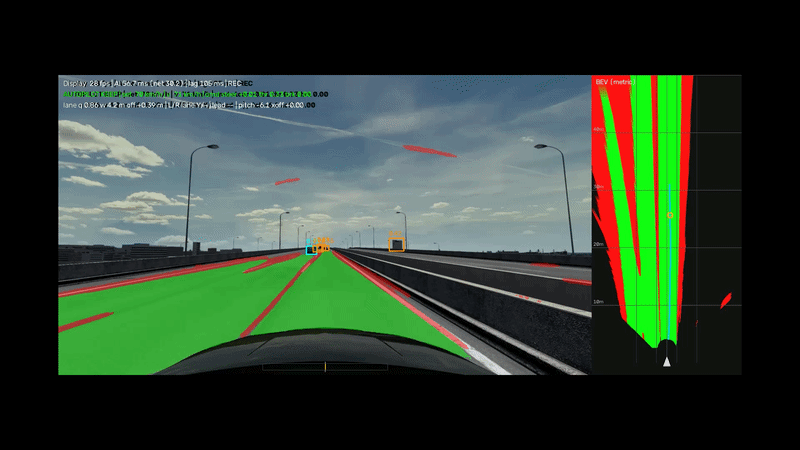
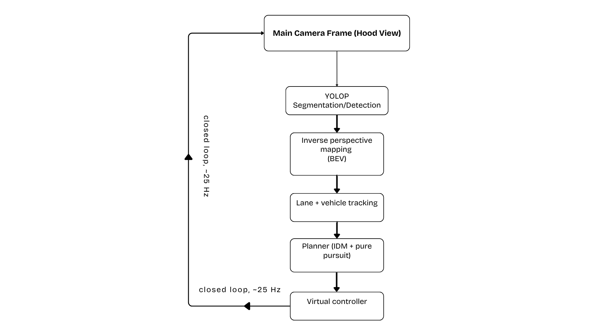

# Real-Time Autonomous Driving Stack (Assetto Corsa)

A camera-only perception, planning and control stack that drives in Assetto Corsa in real time,
built end-to-end: multi-task perception, bird's-eye-view reconstruction, lane/vehicle tracking,
a planner (IDM + pure pursuit + lane-change state machine), and output to the game through a
virtual Xbox controller. Validated offline against an automated 34-check regression suite before
every change was tested in-sim.



## What it does

- **Perception**: YOLOP (drivable-area + lane-line segmentation + vehicle detection) run via
  ONNX Runtime + DirectML which works on AMD/NVIDIA/Intel GPUs, no CUDA lock-in.
- **Bird's-eye view**: monocular inverse-perspective mapping from a calibrated pinhole camera
  model (height, pitch, vertical FOV), with auto-calibration and dynamic pitch compensation from
  live G-force telemetry.
- **Tracking**: a polynomial lane-fit tracker with temporal smoothing and held-over state through
  brief perception misses, and an alpha-beta filter per vehicle with "coasting" memory through
  blind spots.
- **Planning**: IDM (Intelligent Driver Model) for car-following, pure pursuit for lateral control,
  and a lane-change state machine with quintic-profile motion and gap/closing-speed safety checks.
- **Control**: outputs to Assetto Corsa through a virtual Xbox 360 controller (vgamepad/ViGEmBus),
  with a measured, calibrated steering-response curve and a dead-man's-switch watchdog.




## Key engineering decisions

**Pure pursuit over Stanley.** My earlier CARLA project used Stanley control (instantaneous
cross-track + heading error correction), which works well against clean ground-truth lane data.
Vision-derived lane estimates are noisier, pure pursuit's forward-looking geometry (steer toward
a point ahead on the path, rather than correcting the instant error) damps that noise out instead
of amplifying it.

**A skyline false-positive caused phantom braking.** A detection with its box bottom above the
horizon projects to a negative distance when inverted through the ground-plane model (the
geometry assumes the box bottom touches the road right above the horizon, it can't). The fix clamps
near-field, hood-occluded detections to "basically touching" (so the planner still brakes
conservatively when it genuinely can't resolve a close distance) but explicitly discards
negative-Z detections rather than clamping them the same way, otherwise a false detection 50+
metres away (a sign, a building edge) turns into a phantom car on the bumper. Caught by comparing
a full-brake event against a screenshot with nothing actually in front of the car; fixed, then
locked in as a permanent regression test.

**Tight bends need curvature anticipation, not just curvature.** A quadratic lane fit's curvature
reading lags the true curvature while it's still catching up to a tightening bend, so to fix this a
cornering-speed limiter that reacts to the current reading brakes too late for a genuinely sharp
corner, by which point the car can run wide onto the curb before the fit (or the fault handling)
catches up. The fix extrapolates the curvature forward using its recent rate of change, so the
speed limiter reacts to the bend the car is entering, not the shallower one the fit measured a
fraction of a second ago.

**A watchdog, not just a try/except.** The virtual controller holds its last stick position
indefinitely once sent, if the control loop stalls (a blocked capture call, a frozen window), the
car would keep steering/throttling on its own. A background thread independently releases the
controls and applies the brake if no new command has arrived within the timeout, regardless of
what the main loop is doing.

**Full-resolution capture, lower-resolution inference.** dxcam grabs the monitor at its native 
resolution, I kept full-res because pixel-space calibration (the hood occlusion row, the BEV 
homography) needs accurate screen coordinates. But the model's input is a fixed 640×384, so 
every captured frame is letterboxed (aspect-preserving resize + padding, not a stretch, to 
avoid distorting the geometry the detector was trained on) down to that before it reaches the 
GPU. On a consumer gaming GPU rather than a dedicated inference accelerator, running the network
at full capture resolution would miss the real-time budget the planner needs (~25 Hz); letterboxing
down to the model's native input keeps inference fast while the geometry used for distance/position 
math stays anchored to the full-resolution capture.

## Validation

`tests/sim_test.py` is a standalone offline simulator: a synthetic 3-lane road (straight, curved,
or a sudden bend) rendered into noisy segmentation-style masks, driven by a kinematic-bicycle
vehicle model with steering lag, command latency and perception delay using the same planner
code that drives the real game. It runs without Assetto Corsa or a GPU, so every fix below was
reproduced and verified here before being tested in-sim.

```
34/34 checks passed, covering:
  - lane centring on straight and curved roads, including steering-gain mismatch
  - overtaking: single/blind-zone lane changes, collision avoidance, no cutting in
  - manual lane-change requests through lane-identity flips
  - shadow/dry-run mode matching the live planner exactly
  - perception blackouts at speed (straight and curved) without leaving the lane
  - the skyline false-positive / phantom-braking regression
  - sharp bend entry (R=15m, R=12m) without running onto the curb
```

Run it yourself:
```
python tests/sim_test.py
```

## Setup

```
pip install -r requirements.txt
```
On first run in Assetto Corsa:
```
python src/ac_control.py --wiggle       # assign steering/throttle/brake in AC's controller menu
python src/ac_control.py --calibrate    # measure your car's steering response curve (parked)
python src/ac_perception_v5.py --shadow # dry run: computes everything, sends nothing to the game
python src/ac_perception_v5.py          # live: autopilot can be engaged
```
Hotkeys and all CLI flags are listed with `--help` / in each file's module docstring.

### Tested hardware

| | |
|---|---|
| CPU | Intel i5-8400 |
| GPU | AMD Radeon RX 6700 XT (no CUDA unfortunately lol see below) (I am team RED Always) |
| RAM | 16 GB DDR4 |
| OS | Windows |

The perception model runs through **ONNX Runtime + DirectML**, no CUDA was chosen specifically
because the GPU here is AMD, not NVIDIA. DirectML runs the same ONNX model on AMD, Intel or
NVIDIA GPUs without a vendor-specific toolkit, at the cost of being somewhat slower than a
CUDA/TensorRT path would be on equivalent NVIDIA hardware. If you have an NVIDIA GPU, swapping
`onnxruntime-directml` for `onnxruntime-gpu` in `requirements.txt` will work too, but hasn't been
tested here.

## Limitations

- Monocular depth (no stereo/lidar); distance estimates come from a flat-ground assumption and
  degrade on hills or bumps.
- A fixed-FOV front camera has a physical limit on how sharp a bend it can resolve before entering
  it; below roughly R=10-12m at highway speed, slowing down earlier is the right fix, not
  squeezing more out of the curvature estimate.
- Validated in Assetto Corsa only; the perception/planning stack is simulator-specific in its
  calibration (camera height/pitch, hood geometry) even though the algorithms are general.

## Background

Built after a closed-loop control project in CARLA (PID longitudinal + Stanley lateral control),
applied here to a from-scratch perception pipeline against a commercial game's raw screen output,
no ground-truth lane/vehicle data, just what a real monocular camera would see.

## Acknowledgments
Perception runs on YOLOP (Wu, D. et al., "YOLOP: You Only Look Once for Panoptic Driving Perception," 2022)
which is a pretrained multi-task network for drivable-area segmentation, lane-line segmentation and 
vehicle detection, used here via its public PyTorch -> ONNX export, not retrained or fine-tuned. 
Everything downstream of the raw network output, the bird's-eye-view reconstruction, calibration, tracking, 
planning and control is original to this project.

## License

MIT License - see [LICENSE](LICENSE).
